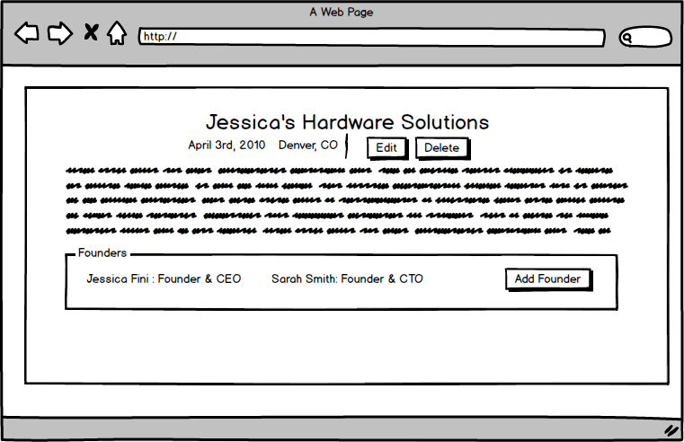
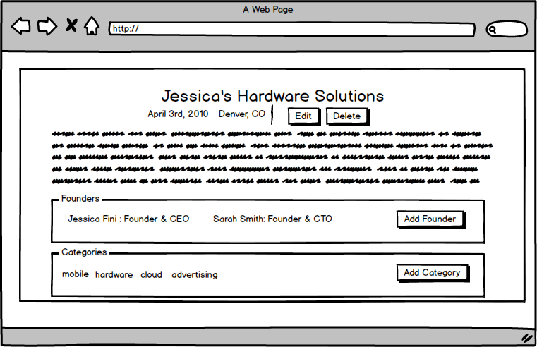

# Techstars Engineering: Fun with Code

Welcome to the Techstars Engineering Code Challenge. This is your chance to show the team how you approach problems and give us insight into your abilities. For the challenge, you are required to design, develop, and style an MVC application. Feel free to use any third party libraries you see fit. Low-fi mockups have been provided, but please feel free to take your own artistic direction. You will have **48 hours** to submit a solution for the given requirements. Please read all the instructions carefully and email us if you have any questions. 

## Getting Started
First, fork this repository into your own GitHub account. Then complete each of the parts below, working as you would in a professional environment. Once you have completed all the sections, please update the README to reflect how to build and run your application, as well as any architectural decisions you have made. When you believe you are ready to submit your challenge, submit a pull request into our master branch. We will see the notification and get back to you on next steps. 

## What we are looking for

* Ability to set up an MVC applicatoin (Strongly Recommend Rails).
* Ability to set up a Relational Database
* Understanding of the HTTP protocol and how it works with Rails' "RESTful" conventions
* Understanding the basics of CRUD
  * Create
  * Read
  * Update
  * Delete
* Ability to layout and design an HTML page with CSS
* Ability to develop automated tests for your application
* Ability to interpret requirements

## The Challenge

### Intro

Build an application that will be a directory of companies, and the people who have founded them. The main page should be a list of all the companies with some high-level information (Name, Short Description, City, State). When the user click on a company, show its details. Included in those details will be the founding members of company, a long description, and a collection of categories the company belongs to.

### Part 1 : Companies Index

1. Create the basic layout for the page
2. Create a list view of all companies
  * Company Name
  * Company Location
  * Short Description
3. Add ability to create a new company
 

### Part 2 : Companies Create

1. Implement form to create a new company
2. Fields
    * Company Name __required__
    * Company Location (City, State) __required__
    * Company Description __required__
    * Founded Date
 

### Part 3 : Company Details

1. Shows all of the company's information
2. Ability to update company
3. Ability to delete company
 

### Part 4 : Founders

1. In the Company details add the ability to add a Founder to a Company.
2. Each Founder can only belong to a single company.
3. Founder  Fields
    * Founder Full Name
    * Founder Title
4. Founders added should display in the company detail page.
 

### Part 5 : Tags

1. In the Company details add the ability to tag a company with categories. 
2. Each category can belong to a number of different companies.
3. Tags added should appear in the company detail page.
 

### Part 6 : Stretch Challenges
This section of the challange in not required but would give us greater insight into your abilities. Pick and choose the stretch challenges as you like.

A. Create a test suite for your application, writing unit and or functional tests that adequately cover the code base. TDDers will have already completed this stretch challenge.
B. Using the libraries and image hosting service of your choice, add the ability to upload images to a company. Then add the image into the index, show, and edit page. 
C. Sign-up for a Heroku account (or other provider) and deploy your application to the web. Please provide us with deployed URL. Bonus points for using a provider other than Heroku.
